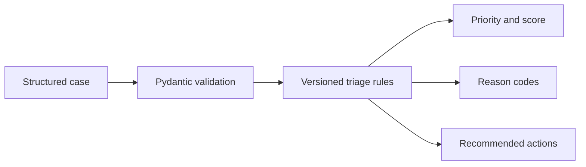

# PV Case Triage API

[](https://github.com/nazil0786digital-spec/pv-case-triage-api/actions/workflows/ci.yml)
[](https://www.python.org/)
[](https://fastapi.tiangolo.com/)
[](LICENSE)

An explainable, rules-first API that prioritizes **synthetic pharmacovigilance cases** and returns the reason codes behind every result. It demonstrates how PV domain rules can be translated into testable software without hiding decisions inside an LLM.

> **Important:** This is a portfolio demonstration, not a validated safety system. It does not replace medical review, regulatory assessment, or an organization's SOPs.

## Why this project exists

Case intake teams need consistent prioritization, but opaque scoring is difficult to review and validate. This service makes every decision reproducible through versioned rules, structured inputs, explicit reason codes, and automated tests.

## What it demonstrates

- Four ICSR minimum criteria checks
- Seriousness, expectedness, causality, and medical-confirmation scoring
- Priorities: `incomplete`, `low`, `medium`, `high`, and `critical`
- Human-readable recommended actions and machine-readable reason codes
- Input validation with Pydantic
- Interactive OpenAPI documentation through FastAPI
- Request correlation and structured latency/status logging
- Privacy-aware observability that excludes case payloads from logs
- Unit tests, linting, Docker support, and GitHub Actions CI

## Architecture



The engine is deliberately deterministic. An LLM could later summarize narratives or propose extracted fields, but a reviewer should approve those fields before this rules layer processes them.

## Run locally

```bash
python -m venv .venv
source .venv/bin/activate
pip install -e ".[dev]"
uvicorn app.main:app --reload
```

Open `http://127.0.0.1:8000/docs` for the interactive API documentation.

## Try the API

```bash
curl -X POST http://127.0.0.1:8000/v1/triage \
  -H "Content-Type: application/json" \
  --data @examples/fatal_case.json
```

Example output:

```json
{
  "case_id": "SYNTH-2026-001",
  "valid_icsr": true,
  "priority": "critical",
  "score": 95,
  "reason_codes": [
    "VALID_MINIMUM_CRITERIA",
    "SERIOUS_EVENT",
    "DEATH_REPORTED",
    "UNEXPECTED_EVENT",
    "POSSIBLE_CAUSALITY",
    "MEDICALLY_CONFIRMED"
  ],
  "recommended_actions": [
    "Queue for standard case intake",
    "Route for expedited seriousness review",
    "Escalate immediately for fatal-case assessment",
    "Verify expectedness against the applicable reference safety information"
  ],
  "missing_minimum_criteria": [],
  "ruleset_version": "1.0.0",
  "disclaimer": "Decision-support demonstration only. It does not replace medical review, regulatory assessment, or an organization's validated procedures."
}
```

## Observability

Every HTTP response includes an `X-Request-ID` header. A valid UUID supplied by the caller is propagated; otherwise the API generates a new UUID. This makes it possible to correlate client-side errors with server-side request logs.

Each completed request emits a structured JSON log containing only operational metadata:

```json
{
  "request_id": "8f2d6fb8-f73f-4b9c-a5c8-68d442da93b4",
  "method": "POST",
  "path": "/v1/triage",
  "status_code": 200,
  "duration_ms": 4.27
}
```

Request bodies, case fields, patient information, and other PV payload data are deliberately excluded from request logs. This keeps the telemetry useful for debugging and performance monitoring without unnecessarily copying potentially sensitive case data into the logging layer.

## Scoring model

| Rule | Points |
|---|---:|
| Valid minimum criteria | 10 |
| Any serious criterion | 40 |
| Death | 25 |
| Life-threatening | 20 |
| Unexpected event | 15 |
| Related / possibly related | 10 / 5 |
| Medically confirmed | 5 |

Scores are capped at 100. Missing any minimum criterion returns `incomplete` rather than a misleading numeric priority.

## Test

```bash
ruff check .
pytest -q
```

## Roadmap

- Configurable reporting rules by market and product
- Audit-event persistence with immutable ruleset references
- Human-in-the-loop narrative extraction
- Role-based review workflow and metrics dashboard
- Validated reference-data integration

## Author

**Nazil Wasim** — Business Analysis, Pharmacovigilance, Enterprise SaaS, and Applied AI
